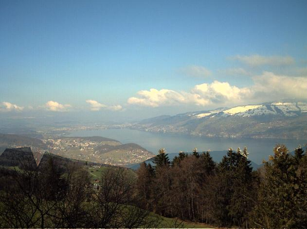

# Tensorflow GP-GAN

Tensorflow implementation of [GP-GAN: Towards Realistic High-Resolution Image Blending](https://arxiv.org/pdf/1703.07195.pdf)
 by Hui-Kai Wu et al. You can find the original implementation in Chainer [here](https://github.com/wuhuikai/GP-GAN).

_Currently, only the supervised learning approach is implemented_

### Installation

Code tested in python 3.6.0 and Tensorflow 1.15.0.

Install the requirements with:\
`pip install -r requirements.txt`

### Train GP-GAN
(To skip writing data paths in the following steps, place the downloaded Transient Attributes Dataset under 
_'DataBase/TransientAttributes/imageAlignedLD'_ and use the default paths )

1. Download Transient Attributes Dataset [here](http://transattr.cs.brown.edu/files/aligned_images.tar)
2. Crop the images using the bounding boxes at _DataBase/TransientAttributes/bbox.txt_
    ```
    python crop_aligned_images.py --data_root "path to imageAlignedLD"
    ```
3. From the cropped images, create copy-paste images and write TFRecords
   ```
   python write_tf_records.py --dataset_dir "path to cropped_images"
   ```
4. Train blending GAN
    ```
    python train_blending_gan.py --train_data_root "path to train.tfrecords" --val_data_root "path to val.tfrecords" --save_folder "output path" --experiment "experiment name"
    ```
    To resume training from a checkpoint use the flag `--weights_path "path to .ckpt"`

 ###### Checking your training with TensorBoard:
 
 Run TensorBoard:
 ```
 tensorboard --logdir="path to tensorboard folder"
 ```
 Under Scalars you will find the training graphs. The X axis represents cycle
  (each cycle includes N discriminator steps and 1 generator step).
  
  - Training_disc_loss: Discriminator loss. Calculated as _train_disc_value_real - train_disc_value_fake_.
  - Train_disc_value_fake: Output value from the discriminator for fake (generated) images.
  - Train_disc_value_real: Output value from the discriminator for real images.
  - Train_gen_disc_component: From the generator loss, the component representing how much you fool the discriminator.
  - Train_gen_l2_component: From the generator loss, the component representing the l2 difference between generated image and background (destination) image.
  - Train_gen_loss: Total generator loss as the sum of the previous 2 components.
  - Val_disc_loss: Validation discriminator loss.
  - Val_gen_loss: Validation generator loss.
  
  _Notice that resuming training from a checkpoint that's older
   than the last logged value in tensorboard can result in a graph that goes back and forward again._
 
 

 Under images you will find image samples from the training process: 

  
### Blending images with GP-GAN

After training the GAN, we can load the weights and blend images. The supported input is a source image, a destination image and a binary mask.

```
python run_gp_gan.py --src_image images/test_images/src.jpg --dst_image images/test_images/dst.jpg --mask_image images/test_images/mask.png --blended_image images/test_images/result.png --generator_path "path to .ckpt"
```


| Source | Destination | Mask | Composited | Blended |
| --- | --- | --- | --- | --- |
|  |  |  |  |  |